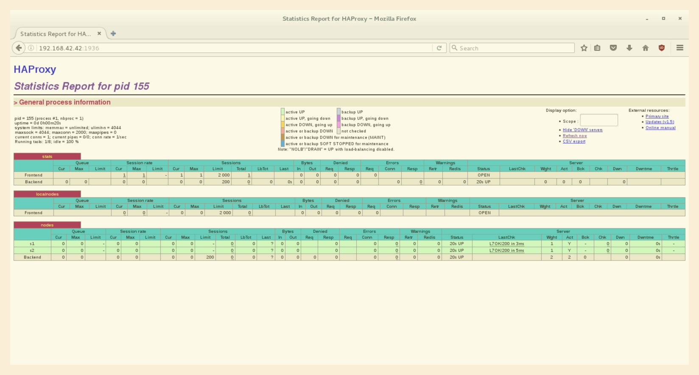
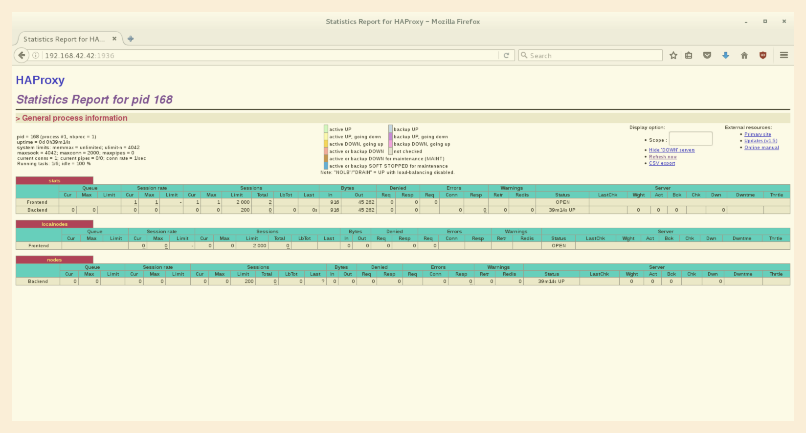
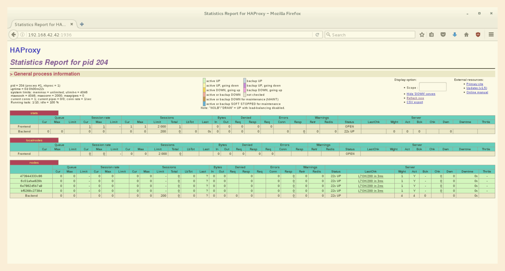
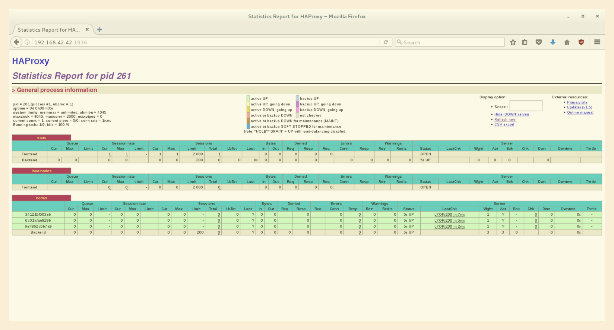

# LABORATOIRE 4 - DOCKER

Lors du [précédent laboratoire](https://github.com/SoftEng-HEIGVD/Teaching-HEIGVD-AIT-2015-Labo-02),
nous avions dû mettre en place, une petite infrastructure, composée d'un load
balancer, et de deux noeuds contenant une application web. Chaque élément,
était modélisé, par un conteneur `docker`. Cette infrastructure minimaliste,
nous permettait de tester, et de comprendre, les mécanismes internes d'un load
balancer.

Le présent laboratoire fait office de suite. Nous reprennons cette
infrastructure, pour l'améliorer.

## ÉTUDIANTS

* FRANCHINI Fabien ([@crab_one](https://twitter.com/crab_one))
* HENNEBERGER Sébastien ([@Shen299](https://twitter.com/Shen299))

## TABLE DES MATIÈRES

1. [Tâche 0 - Identification des problèmes et installation des outils](#t%C3%82che-0---identification-des-probl%C3%88mes-et-installation-des-outils)
2. [Tâche 1 - Ajout d'un processus superviseur](#t%C3%82che-1---ajout-dun-processus-superviseur)
3. [Tâche 2 - Ajout d'un outil pour la gestion des membres dans un cluster web](#t%C3%82che-2---ajout-dun-outil-pour-la-gestion-des-membres-dans-un-cluster-web)
4. [Tâche 3 - Réaction aux changements des membres](#t%C3%82che-3---r%C3%89action-aux-changements-des-membres)
5. [Tâche 4 - Utilisation d'un moteur de template pour la génération des fichiers de configuration](#t%C3%82che-4---utilisation-dun-moteur-de-template-pour-la-g%C3%89n%C3%89ration-des-fichiers-de-configuration)
6. [Tâche 5 - Génération d'une nouvelle configuration, du load balancer, lors des changements de membres](#t%C3%82che-5---g%C3%89n%C3%89ration-dune-nouvelle-configuration-du-load-balancer-lors-des-changements-de-membres)
7. [Tâche 6 - Rafraîchissement automatique de la configuration du load balancer](#t%C3%82che-6---rafraichissement-automatique-de-la-configuration-du-load-balancer)
8. [Difficultés rencontrées](#difficult%C3%89s-rencontr%C3%89es)
9. [Conclusion](#conclusion)

## TÂCHE 0 - IDENTIFICATION DES PROBLÈMES ET INSTALLATION DES OUTILS

Ce chapitre, décrit les faiblesses de l'état actuel de l'infrastructure, et sert
guide pour les tâches suivantes à réaliser.

### QUESTIONS/RÉPONSES

> **[m1]** Do you think we can use the current solution for a production
environment? What are the main problems when deploying it in a production
environment?

En l'état actuel, cette solution n'est pas adaptée à un environement de
production. Son plus gros défaut, est que la configuration des noeuds du load
balancer est statique. C'est à dire que, pour rajouter un nouveau noeud, nous
devons manuellement, d'une part, modifier la configuration du load balancer, et
d'autre part le redémarrer, pour qu'il puisse le prendre en compte, et ainsi
l'utiliser.

> **[m2]** Describe what you need to do to add new `webapp` container to the
infrastructure. Give the exact steps of what you have to do without modifiying
the way the things are done. Hint: You probably have to modify some
configuration and script files in a Docker image.

L'ajout d'un nouveau noeud dans l'infrastructure, se procède en deux étapes. La
première consiste à créer, un nouveau conteneur `docker`, et à l'ajouter dans
l'infrastructure de `vagrant`. La deuxième, de mettre à jour la configuration du
load balancer pour qu'il prenne en compte, son existence.

Initialement, le lancement des conteneurs `docker`, se déroule par l'exécution
du script de provisionnement de la machine `vagrant`, nommé `provision.sh`. En
effet, lors de la construction d'une machine virtuelle avec `vagrant`, nous
pouvons déclarer un script qui permet de configurer, cette machine, de manière
déterministe.

Dans ce script, nous rajoutons, en nous basant sur ce qui a déjà été fait, les
instructions permettant de rajouter un troisième noeud.

```
# Run three webapps
echo "************************  run webapps  ************************"
docker rm -f s1 2>/dev/null || true
docker rm -f s2 2>/dev/null || true
docker rm -f s3 2>/dev/null || true
docker run -d --name s1 softengheigvd/webapp
docker run -d --name s2 softengheigvd/webapp
docker run -d --name s3 softengheigvd/webapp
```

De plus, pour faciliter la gestion de ces conteneurs, l'infrastructure
proposée, possède un script utilitaire qui permet de redémarrer
les conteneurs, à tout moment. Il s'appel `start-containers.sh` et se situe
à la racine du dossier partagé, `/vagrant`.

Nous le modifions comme suit:

```
# Run three webapps
echo "************************  run webapps  ************************"
docker rm -f s1 2>/dev/null || true
docker rm -f s2 2>/dev/null || true
docker rm -f s3 2>/dev/null || true
docker run -d --name s1 softengheigvd/webapp
docker run -d --name s2 softengheigvd/webapp
docker run -d --name s3 softengheigvd/webapp
```

Nous remarquons, d'ores et déjà, à quel point il est fastidieux de mettre à
jour, l'infrastructure. En effet, il serait plus judicieux, d'avoir un mécanisme
où nous n'avons qu'a spécifier le nombre de conteneurs à démarrer.

Ensuite, il faut modifier la configuration du load balancer, pour qu'il prenne
en compte le nouveau noeud. Par le laboratoire précédent, nous savons qu'il faut
modifier le fichier `haproxy.cfg`, situé dans le dossier
`/usr/local/etc/haproxy`, du conteneur.

Comme avant, nous nous basons sur ce qui a déjà été fait, pour rajouter le
nouveau noeud.

```
server s1 <s1>:3000 check
server s2 <s2>:3000 check
server s3 <s3>:3000 check
```

Après quelques recherches, nous remarquons la présence d'un script, nommé
`run.sh`, qui opère sur les noeuds. Nous rajoutons une nouvelle opération, pour
le troisième noeud.

```
sed -i 's/<s1>/$S1_PORT_3000_TCP_ADDR/g' /usr/local/etc/haproxy/haproxy.cfg
sed -i 's/<s2>/$S2_PORT_3000_TCP_ADDR/g' /usr/local/etc/haproxy/haproxy.cfg
sed -i 's/<s3>/$S3_PORT_3000_TCP_ADDR/g' /usr/local/etc/haproxy/haproxy.cfg
```

Ces commandes, substituent avec l'utilitaire `sed`, la chaîne de caractères
`<s3>`, par une variable d'environnement nommé `$S3_PORT_3000_TCP_ADDR`, dans le
fichier de configuration du load balancer.

Comme la présente configuration n'est pas dynamique, il est impératif de
reconstruire et redémarrer le conteneur contenant le load balancer.

> **[m3]** Based on your previous answers, you have detected some issues in the
current solution. Now propose a better approach at a high level.

Pour rappel, nous avons détecté que la principale faiblesse de la solution
proposée, est sa configuration statique. Cette méthodologie, peut engendrer
des erreures de la part d'un administrateur non-méticuleux.

Dans l'idéal, nous souhaitons que les étapes nécessaires à l'ajout d'un nouveau
noeud, soient extrêmement simples à réaliser. Au final, nous devrions uniquement
avoir besoin de déclarer le noeuds contenant l'application web, et qu'ils soient
dynamiquement pris en compte par le load balancer.

> **[m4]** You probably noticed that the list of web application nodes is
hardcoded in the load balancer configuration. How can we manage the web app
nodes in a more dynamic fashion?

Durant le semestre précédent dans le cadre du cours `RES`, nous avions dû
réaliser [un laboratoire](https://github.com/crabone/Teaching-HEIGVD-RES-2016-Labo-DockerMusic),
introduisant la notion de `multicast`. Pour résumer, nous avions un orchestre
composé de musiciens. Chaque entité était modélisé par un conteneur `docker`.
Nous devions faire en sorte, que l'orchestre soit capable, de prendre en compte
dynamiquement, l'ajout d'un nouveau musicien.

Nous pouvons nous inspirer de ce travail, pour résoudre les problèmes mis en
évidence par l'infrastructure actuelle. Nous imaginons par exemple, qu'un
nouveau noeud doit s'annoncer auprès du load balancer, pour qu'il soit pris en
compte automatiquement.

> **[m5]** In the physical or virtual machines of a typical infrastructure we
tend to have not only one main process (like the web server or the load
balancer) running, but a few additional processes on the side to perform
management tasks.

> For example to monitor the distributed system as a whole it is common to
collect in one centralized place all the logs produced by the different
machines. Therefore we need a process running on each machine that will forward
the logs to the central place. (We could also imagine a central tool that
reaches out to each machine to gather the logs. That's a push vs. pull problem.)
It is quite common to see a push mechanism used for this kind of task.

> Do you think our current solution is able to run additional management
processes beside the main web server / load balancer process in a container?
If no, what is missing / required to reach the goal? If yes, how to proceed to
run for example a log forwarding process?

En l'état actuel, la présente solution ne permet pas d'exécuter des processus de
maintenance. Nous sommes confrontés à deux problèmes. Le premier, est le fait
d'exécuter plusieurs processus en parralèle dans un conteneur `docker`. Le
deuxième, de mettre en place un conteneur qui va collecter les logs.

Pour exécuter plusieurs processus en parralèle, nous proposons d'écrire un
script, qui au lancement du conteneur, lance les applications (load balancer et
applications web), et un service qui transmet les logs vers un autre conteneur,
comme `rsyslog`.

> **[m6]** In our current solution, although the load balancer configuration is
changing dynamically, it doesn't follow dynamically the configuration of our
distributed system when web servers are added or removed. If we take a closer
look at the `run.sh` script, we see two calls to `sed` which will replace two
lines in the `haproxy.cfg` configuration file just before we start `haproxy`.
You clearly see that the configuration file has two lines and the script will
replace these two lines.

> What happens if we add more web server nodes? Do you think it is really
dynamic? It's far away from being a dynamic configuration. Can you propose a
solution to solve this?

[réponse]

### LIVRABLES

> Take a screenshot of the stats page of HAProxy at http://192.168.42.42:1936.
You should see your backend nodes.

Cette première manipulation, consiste à vérifier que tout les outils sont
correctement installés et configurés. Nous n'avons pas eu de problèmes
particuliers. Les conteneurs sont correctement lancés.

```
vagrant@ubuntu-14:~$ docker ps
CONTAINER ID        IMAGE                  COMMAND                  CREATED             STATUS              PORTS                                                                NAMES
871d3e857a1b        softengheigvd/ha       "/docker-entrypoint.s"   2 minutes ago       Up 2 minutes        0.0.0.0:80->80/tcp, 0.0.0.0:1936->1936/tcp, 0.0.0.0:9999->9999/tcp   ha
fb19fa353748        softengheigvd/webapp   "/scripts/run.sh"        2 minutes ago       Up 2 minutes        3000/tcp                                                             s2
28d04ddaf5b7        softengheigvd/webapp   "/scripts/run.sh"        2 minutes ago       Up 2 minutes        3000/tcp                                                             s1
```

Nous nous rendons sur le dashboard de `HAProxy` et constatons que tout
fonctionne correctement. Les noeuds `s1` et `s2` sont présents.


## TÂCHE 1 - AJOUT D'UN PROCESSUS SUPERVISEUR

Dans ce chapitre, nous installons des outils permettant de résoudre les
problèmes et faiblesses, énoncées dans la tâche précédente, à la question
**[m5]**

### LIVRABLES

> Take a screenshot of the stats page of HAProxy at http://192.168.42.42:1936.
You should see your backend nodes. It should be really similar to the screenshot
of the previous task.

Après avoir appliqué les modifications proposées, nous nous rendons une nouvelle
fois sur le dashboard de `HAProxy`. Nous constatons que tout fonctionne
correctement.



Nous n'observons pas de différence notable, par rapport à la capture d'écran,
précédente.

> Describe your difficulties for this task and your understanding of what is
happening during this task. Explain in your own words why are we installing a
process supervisor. Do not hesitate to do more research and to find more
articles on that topic to illustrate the problem.

Après avoir défini nos besoins, nous nous sommes vite confrontés aux limitations
de la philosophie de `docker` (Un seul processus par conteneur).

Pour les besoins du laboratoire, nous souhaitons que chaque noeud rejoint un
cluster. Pour ce faire il est impératif qu'un service (processus), permettant de
s'y rendre, soit présent dans chaque conteneur.

À la fin d'un `Dockerfile`, nous devons spécifier quel sera le processus qui
sera exécuter par le conteneur, avec l'instruction `CMD` ou `ENTRYPOINT`. Cette
instruction doit être unique. Naturellement, nous aimerions savoir comment
est-il possible de lancer de plusieurs processus. Une première façon de faire
est décrite dans la précédente tâche, à la question **[m5]**.

Ici, on nous propose d'installer `S6` et d'utiliser sa fonctionnalité, nommée
`S6-overlay`. Grosso-modo, c'est le chef d'orchestre du système. C'est lui
qui est chargé, au démarrage du système, de lancer les différents services.
Dans le monde Unix, on le compare à `systemd` ou `init.d`.

En spécifiant `S6` comme point d'entrée, nous lui délèguons la tâche de lancer
nos services, et ainsi outrepasser la limitation de la philosophie de `docker`.
Pour qu'il prenne en compte, les services définis par l'utilisateur, il faut:

1. Créer un sous-dossier dans `/etc/services.d`, ayant pour nom, le nom du
service.
2. Ajouter un script nommé `run`, contenant les instructions de lancement, du
service.

Ensuite, au démarrage du conteneur, `S6` se chargera, d'exécuter tout les
scripts, `run`.

**Note:** Nous n'avons pas eu de diffulté pour réaliser cette étape. La
procédure est guidée et nous permet d'éviter de faire certaines erreures.

## TÂCHE 2 - AJOUT D'UN OUTIL POUR LA GESTION DES MEMBRES DANS UN CLUSTER WEB

Dans ce chapitre, nous installons les outils permettant la création et la
gestion d'un cluster. Cette procédure, vise à répondre, partiellement, aux
problèmes énoncés dans les question **[m4]** et **[m5]**.

### LIVRABLES

> Provide the docker log output for each of the containers: `ha`, `s1` and `s2`.
You need to create a folder logs in your repository to store the files
separately from the lab report. For each lab task create a folder and name it
using the task number. No need to create a folder when there are no logs.

> Example:

> ```
|-- root folder
 |-- logs
   |-- task 1
   |-- task 3
   |-- ...
```

Nous avons receuilli les logs, après l'exécution du script
`start-containers.sh`. Du coup, l'ordre de démarrage des conteneurs est le
suivant:

s1 -> s2 -> ha

Par contre, contrairement à ce qui est dit dans l'énoncé:

> If we start s1 and s2 nodes before ha, we will have an error from Serf. They
try to connect the Serf cluster via ha container which is not running.

Nous n'avons pas remarqué d'erreurs. Le premier noeud `s1`, créé et rejoint le
cluster, nommé "ha". Ensuite, les autres noeuds, rejoingnent sans souci, ce
nouveau cluster.

* [Logs de s1](logs/task2/s1)
* [Logs de s2](logs/task2/s2)
* [Logs de ha](logs/task2/ha)

> Give the answer to the question about the existing problem with the current
solution.

Nous avons mis en place un système permettant la reconnaissance, de nouveaux
noeuds, dans le cluster. Cette une étape cruciale pour l'élaboration de notre
nouvelle infrastructure.

Nous avons à présent un moyen pour les noeuds du load balancer, de s'annoncer
auprès de lui. Ensuite, il reste à mettre en place, leur prise de charge, par la
modification dynamique de la configuration du load balancer.

> Give an explanation on how `Serf` is working. Read the official website to get
more details about the `GOSSIP` protocol used in `Serf`. Try to find other
solutions that can be used to solve similar situations where we need some
auto-discovery mechanism.

`Serf` est un outil permettant la création d'un cluster décentralisé. Il se
repose sur le protocole `GOSSIP` pour émettre des messages aux différents
noeuds.

Une entité (noeud), à le choix de créer ou de rejoindre un cluster. Pour
rejoindre, un cluster, le nouveau noeud doit impérativement connaître un membre.
Il s'annonce auprès de lui et ensuite cette information est propagé auprès des
autres membres du cluster.

Il est envisageable d'utiliser cette technologie pour, par exemple:

1. Surveillance et maintenance

Un ensemble de noeuds se basant sur le protocole `GOSSIP`, peut être très
facilement surveillé. En effet, nous pouvons détecter efficacement si un noeud
est `UP` ou `DOWN`. De plus, nous pouvons propager des ordres, aux différents
noeuds, pour qu'il exécutent certaines opérations

2. Botnet

Un botnet fonctionnant avec le protocole `GOSSIP`, est très facilement
maintenable pour toutes les raisons citées plus haut.

## TÂCHE 3 - RÉACTION AUX CHANGEMENTS DES MEMBRES

Dans ce chapitre, nous allons nous attarder sur la configuration de `Serf` et
ainsi voir comment déclancher des actions, lorsqu'un nouveau noeud, rejoint le
cluster.

### LIVRABLES

> Provide the docker log output for each of the containers: ha, s1 and s2. Put
your logs in the logs directory you created in the previous task.

Les logs fournit en annexe, dans le dossier `/logs/task3` ont été prélevés
**après** que toutes les entités aient été démarrés.

Lorsque nous démarrons le conteneur `ha`, nous obtenons les logs suivants:

```
[s6-init] making user provided files available at /var/run/s6/etc...exited 0.
[s6-init] ensuring user provided files have correct perms...exited 0.
[fix-attrs.d] applying ownership & permissions fixes...
[fix-attrs.d] done.
[cont-init.d] executing container initialization scripts...
[cont-init.d] done.
[services.d] starting services
[services.d] done.
/opt/bin/serf agent --join ha --replay --event-handler member-join=/serf-handlers/member-join.sh --event-handler member-leave,member-failed=/serf-handlers/member-leave.sh --tag role=balancer
==> Starting Serf agent...
==> Starting Serf agent RPC...
==> Serf agent running!
         Node name: '2c938a34b190'
         Bind addr: '0.0.0.0:7946'
          RPC addr: '127.0.0.1:7373'
         Encrypted: false
          Snapshot: false
           Profile: lan
==> Joining cluster...(replay: true)
[WARNING] 352/113400 (173) : Server nodes/s1 is DOWN, reason: Layer4 connection problem, info: "Connection refused", check duration: 0ms. 1 active and 0 backup servers left. 0 sessions active, 0 requeued, 0 remaining in queue.
    Join completed. Synced with 1 initial agents

==> Log data will now stream in as it occurs:

    2016/12/18 11:34:00 [INFO] agent: Serf agent starting
    2016/12/18 11:34:00 [INFO] serf: EventMemberJoin: 2c938a34b190 172.18.0.2
    2016/12/18 11:34:00 [INFO] agent: joining: [ha] replay: true
    2016/12/18 11:34:00 [INFO] agent: joined: 1 nodes
    2016/12/18 11:34:01 [INFO] agent: Received event: member-join
[WARNING] 352/113401 (173) : Server nodes/s2 is DOWN, reason: Layer4 connection problem, info: "Connection refused", check duration: 0ms. 0 active and 0 backup servers left. 0 sessions active, 0 requeued, 0 remaining in queue.
[ALERT] 352/113401 (173) : backend 'nodes' has no server available!
```

Premièrement, nous observons le démarrage de `S6` et des services associés. Nous
constatons l'absence des noeuds `s1` et `s2` par la présence d'avertissements
fournis par `HAProxy`.

Ensuite, nous observons de manière détaillée, le comportement de `Serf`.

```
2016/12/18 11:34:49 [INFO] serf: EventMemberJoin: 7bd1da5e0193 172.18.0.3
2016/12/18 11:34:50 [INFO] agent: Received event: member-join
2016/12/18 11:36:01 [INFO] serf: EventMemberJoin: 7fedf35e6252 172.18.0.4
2016/12/18 11:36:02 [INFO] agent: Received event: member-join
```

Quand un nouveau noeud rejoint le cluster, le message `member-join` est
propagé dans les noeuds existants.

* [Logs de s1](logs/task3/s1)
* [Logs de s2](logs/task3/s2)
* [Logs de ha](logs/task3/ha)

> Provide the logs from the `ha` container gathered directly from the
`/var/log/serf.log` file present in the container. Put the logs in the `logs`
directory in your repo.

Quand `ha` reçoit le message `member-join`, il exécute le script
`member-join.sh`. Ceci est dû par la présence de l'argument
`--event-handler member-join=/serf-handlers/member-join.sh`, passé à la commande
`serf agent`.

Les logs contenus dans `/var/log/serf.log`, confirment ce comportement.

[Logs de serf.log](logs/task3/ha.serf)

## TÂCHE 4 - UTILISATION D'UN MOTEUR DE TEMPLATE POUR LA GÉNÉRATION DES FICHIERS DE CONFIGURATION

Dans ce chapitre, nous allons poser les base pour la mise à jours automatique de
la configuration du load balancer, lorsqu'un nouveau noeud rejoint le cluster.

### LIVRABLES

> You probably noticed when we added `xz-utils`, we have to rebuild the whole
image which took some time. What can we do to mitigate that? Take a look at the
Docker documentation on [image layers](https://docs.docker.com/engine/userguide/storagedriver/imagesandcontainers/#images-and-layers).
Tell us about the pros and cons to merge as much as possible of the command.
In other words, compare:

> ```
RUN command 1
RUN command 2
RUN command 3
```

> vs.

> ```RUN command 1 && command 2 && command 3```

> There are also some articles about techniques to reduce the image size.
Try to find them. They are talking about `squashing` or `flattening` images.

[réponse]

> Propose a different approach to architecture our images to be able to reuse as
much as possible what we have done. Your proposition should also try to avoid as
much as possible repetitions between your images.

[réponse]

> Provide the `/tmp/haproxy.cfg` file generated in the `ha` container after each
step. Place the output into the `logs` folder like you already did for the
Docker logs in the previous tasks. Three files are expected.

> In addition, provide a log file containing the output of the `docker ps`
console and another file (per container) with `docker inspect <container>`. Four
files are expected.

Nous constatons qu'à chaque fois qu'on conteneur démarre, le fichier est
écrasé. Ce qui nous oblige de répéter la procédure proposée.

* [Logs haproxy.cfg après le démarrage de ha](logs/task4/haproxy.cfg-after_ha_starts)
* [Logs haproxy.cfg après le démarrage de s1](logs/task4/haproxy.cfg-after_s1_starts)
* [Logs haproxy.cfg après le démarrage de s2](logs/task4/haproxy.cfg-after_s2_starts)
* [Output de la commande `docker ps`](logs/task4/docker_ps)
* [Output de la commande `docker inspect ha`](logs/task4/docker_inspect_ha)
* [Output de la commande `docker inspect s1`](logs/task4/docker_inspect_s1)
* [Output de la commande `docker inspect s2`](logs/task4/docker_inspect_s2)

> Based on the three output files you have collected, what can you say about the
way we generate it? What is the problem if any?

La présente solution a le désavantage, d'écraser les précédents logs. Ceci est
dû à l'opérateur de redirection utilisé dans le script `member-join.sh`:

```
# Generate the output file based on the template with the parameters as input for placeholders
handlebars --name $HOSTNAME --ip $HOSTIP < /config/haproxy.cfg.hb > /tmp/haproxy.cfg
```

Si nous modifions cette ligne par:

```
# Generate the output file based on the template with the parameters as input for placeholders
handlebars --name $HOSTNAME --ip $HOSTIP < /config/haproxy.cfg.hb >> /tmp/haproxy.cfg
```

Nous pouvons ainsi lancer les trois conteneurs et observer que les logs n'ont
pas été écrasé, à chaque démarrage.

```
vagrant@ubuntu-14:~$ docker exec -ti ha /bin/bash
root@9f1946422a6a:/# cat /tmp/haproxy.cfg
Container 9f1946422a6a has joined the Serf cluster with the following IP address: 172.18.0.2
Container 2bd87f147641 has joined the Serf cluster with the following IP address: 172.18.0.3
Container 95c9910e024f has joined the Serf cluster with the following IP address: 172.18.0.4
```

## TÂCHE 5 - GÉNÉRATION D'UNE NOUVELLE CONFIGURATION, DU LOAD BALANCER, LORS DES CHANGEMENTS DE MEMBRES

Dans ce chapitre, nous allons continuer le travail fait lors de la tâche
précédente, et ainsi générer une nouvelle configuration pour le load balancer.

### LIVRABLES

> Provide the file `/usr/local/etc/haproxy/haproxy.cfg` generated in the `ha`
container after each step. Three files are expected.

> In addition, provide a log file containing the output of the `docker ps`
console and another file (per container) with `docker inspect <container>`. Four
files are expected.

* [Logs haproxy.cfg après le démarrage de ha](logs/task5/haproxy.cfg-after_ha_starts)
* [Logs haproxy.cfg après le démarrage de s1](logs/task5/haproxy.cfg-after_s1_starts)
* [Logs haproxy.cfg après le démarrage de s2](logs/task5/haproxy.cfg-after_s2_starts)
* [Output de la commande `docker ps`](logs/task5/docker_ps)
* [Output de la commande `docker inspect ha`](logs/task5/docker_inspect_ha)
* [Output de la commande `docker inspect s1`](logs/task5/docker_inspect_s1)
* [Output de la commande `docker inspect s2`](logs/task5/docker_inspect_s2)

> Provide the list of files from the `/nodes` folder inside the ha container.
One file expected with the command output.

Nous constatons que l'ajout des noeuds est correctement pris en compte.

* [Output de la commande `ls -l /nodes`](logs/task5/list_nodes)

> Provide the configuration file after you stopped one container and the list of
nodes present in the /nodes folder. One file expected with the command output.
Two files are expected.

Après, avoir stoppé le conteneur `s2`, nous constatons que cela a été
correctement pris en compte.

* [Logs haproxy.cfg après l'arrêt de s2](logs/task5/haproxy.cfg-after_s2_stops)
* [Output de la commande `ls -l /nodes`](logs/task5/list_nodes-after_s2_stops)

Attention tout de même, bien que les fichiers de configurations ont été
modifiés, ils n'ont pas été pris en compte par le load balancer.

> In addition, provide a log file containing the output of the docker ps
console. One file expected.

Dans cette étape, après les manipulations effectuées, nous remarquons le
changement dynamique de la liste des noeuds dans `/nodes` et
`/usr/local/etc/haproxy/haproxy.cfg`. Si nous nous rendons dans le dashboard
de `HAProxy`, nous obtenons les résultats suivants:



Nous constatons que `HAProxy` n'a pas pris en compte les modifications de sa
configuration. La tâche suivante nous permettra de corriger ce problème.

## TÂCHE 6 - RAFRAICHISSEMENT AUTOMATIQUE DE LA CONFIGURATION DU LOAD BALANCER

Dans ce chapitre, nous allons mettre en place le mécanisme qui permet de prendre
en compte, automatiquement, les modifications de la configuration du load
balancer.

### LIVRABLES

> Take a screenshots of the HAProxy stat page showing more than 2 web
applications running. Additional screenshots are welcome to see a sequence of
experimentations like shutting down a node and starting more nodes.

> Also provide the output of `docker ps` in a log file. At least one file is
expected. You can provide one output per step of your experimentation according
to your screenshots.

Pour l'expérience, nous lançons 4 applications web. Nous constatons que le load
balancer fonctionne correctement.



Voici l'output de la commande `docker ps`:

* [Output de la commande `docker ps`](logs/task6/docker_ps)

Si nous stoppons, deux noeuds, nous pouvons observer les changements dans le
dashboard de `HAProxy`.


Si nous rajoutons, un troisième noeuds, nous constatons aussi bien ces
changements.



Nous pouvons aussi noter le changement du `pid`. Comme nous redémarrons
`HAProxy`, alors son numéro d'identification de processus, change.

> Give your own feelings about the final solution. Propose improvements or ways
to do the things differently. If any, provide references to your readings for
the improvements.

Il est difficile de juger la présente solution. En effet, nous ne pensons pas
avoir assez d'expérience pour pouvoir proposé d'alternative, meilleure.
Cependant, nous pouvons relever quelques points:

L'utilisation de `Serf` est très pratique et permet de bénéficier d'avantages
notoires. Cependant, nous doutons de la pertinence, de cet outil dans le cas
présent. Tous les noeuds ont connaissance de la présence des autres noeuds du
réseau. Or est-ce une information pertinente ? Nous pensons que les noeuds de
`HAProxy` n'ont pas besoin de cette information. Nous sommes tenté d'aborder la
solution avec du `multicast`, mais cela requierai un nouveau protocole
applicatif, lourd, entre les noeuds et le load balancer.

Cette dernière tâche soulève aussi la problématique que pour que `HAProxy`, il
soit nécessaire de le redémarrer, pour qu'il puisse prendre en compte la
nouvelle configuration. Nous sommes conscient que cette solution n'est pas
optimale, dans le cas où le temps de réponse et l'uptime soit un critère
essentiel.

Plus anécdotique, mais notable tout de même, les instructions de démarrage des
conteneurs peut être améliorer. Nous pouvons, englober le tout dans un boucle,
où nous n'aurions plus qu'à spécifier le nombre de noeud à démarrer. Cela
éviterai une redondance de code.

## DIFFICULTÉS RENCONTRÉES

Le présent laboratoire est entièrement guidé. De ce fait, l'application des
tâches, est très simple à réaliser. Concernant l'aspect pratique, nous nous
sommes confrontés à un gros problème. Nous n'avions pas remarqué tout de suite,
les mises à jours du repository source qui corrigeaient certains bugs.

Arrivé à la tâche n°4, nous nous sommes heurtés à ces bugs et nous avions crus
que le problème venait de notre solution. De ce fait nous avons perdu, un temps
précieux. Quand nous avons remarqué ces mises à jours, nous avons dû recommencer
les tâches n°3 et n°4. Suite à ce problème, nous n'avons pas pu réaliser les
tâches optionelles.

La principale difficulté, était la rédaction du rapport. Comme l'énoncé est très
complet et que les questions sont liées, nous avons eu du mal à rédiger un
rapport pertinent, sans trop de répétitions.

## CONCLUSION

Nous avons eu beaucoup de plaisir à réaliser ce laboratoire.
